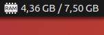

# Memory Indicator

[](https://cirrus-ci.com/github/dawidd6/indicator-memory)



### Installing from PPA

```sh
sudo add-apt-repository ppa:dawidd0811/indicators
sudo apt-get update
sudo apt-get install indicator-memory
```

### Building from source

```sh
sudo apt install libappindicator3-dev cmake
cmake .
sudo make install
```
